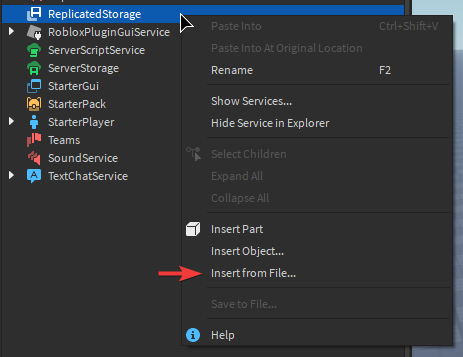

# GridPack
An easy way to create grid-style inventories on Roblox.

## How to Install
Head to the releases page and download the latest gridpack.rbxm file.
Then insert the downloaded file in Roblox Studio by right clicking on ReplicatedStorage and choosing "Insert from File...".



## Getting Started
Here are some small guides to help you get started!
Start by creating a LocalScript and follow along:

### Creating Your First Grid
To create a grid your first grid item manager you will need to use the `.createGrid()` method in GridPack.
Here is an example:

```lua
local GridPack = require(game:GetService("ReplicatedStorage").Packages.GridPack)

local screenGui = Instance.new("ScreenGui")
screenGui.Name = "GridPack"
screenGui.ZIndexBehavior = Enum.ZIndexBehavior.Sibling -- ZIndexBehavior has to be set to Sibling since CanvasGroups don't work with Global and GridPack heavily relies on CanvasGroups.
screenGui.ResetOnSpawn = false
screenGui.Parent = game:GetService("Players").LocalPlayer.PlayerGui

local grid = GridPack.createGrid({
	Parent = screenGui, -- Parent of the grid container

	Visible = true, -- If the grid is visible, changes the containers visible property. Also disables item interaction on all items inside.

	Assets = {
		Slot = nil -- Add your own GuiObject here to customize the slots in the grid.
	},

	GridSize = Vector2.new(8, 15), -- How many slots the grid has on the X and Y axes.
	SlotAspectRatio = 1, -- Aspect ratio of one slot in the grid, helps with different resolutions if you're using scale instead of offset.

	AnchorPoint = Vector2.new(0, 0.5), -- Anchor point of the grid container
	Position = UDim2.new(0, 20, 0.5, 0), -- Position of the grid container
	Size = UDim2.fromScale(0.25, 0.5), -- Size of the grid container

	Metadata = {
		-- Here you are free to store any values you want.
	}
})
```

You should now have a grid on your screen once you join the game!

### Adding Items
Adding items to grids is really easy. But before adding you will have to create a new item. This is done in a simmilar way as creating a grid, but instead you use the `.createItem()` method.
Here is an example showing an item being created and added to the grid we just created:

```lua
-- Continuing from last example.

local item = GridPack.createItem({
    Position = Vector2.new(0, 0), -- Position in a grid.
    Size = Vector.new(2, 3), -- Size in a grid.

    Assets = {
        Item = nil, -- Add a custom GuiObject here to change the item's gui element.
    },
	
    Metadata = {
        -- Here you are free to store any values you want.
    },
})

grid:AddItem(item) -- Add the item to the grid.
```

The item should now be added to the grid and should also be draggable!

### Connecting Item Managers
To connect two item managers together you use a TransferLink. Both Grids and SingleSlots can be connected to eachother and Grid to SingleSlot.
This is done like:

```lua
-- Continuing from last example.

local transferGrid = GridPack.createGrid({
    Parent = screenGui,

    Visible = true

    GridSize = Vector2.new(8, 15),
    SlotAspectRatio = 1,

    AnchorPoint = Vector2.new(1, 0.5),
    Position = UDim2.new(1, -20, 0.5, 0),
    Size = UDim2.fromScale(0.25, 0.5),
})

local transferLink = GridPack.createTransferLink({}) -- Create TransferLink
grid:ConnectTransferLink(transferLink) -- Connect TransferLink to our first grid.
transferGrid:ConnectTransferLink(transferLink) -- Connect the TransferLink to our new grid.
```

You will now be able to drag an item over to the other inventory and it should adjust to the new inventory.

### Single Slots
With SingleSlots you are able to drag any item into it, disreguarding the size and position of the item. This can be used as an equip slot where you have your primary weapon, tool or armor stored.

The SingleSlot setup is a little different than the Grid setup.
Here is and example:

```lua
local GridPack = require(game:GetService("ReplicatedStorage").Packages.GridPack)

local screenGui = Instance.new("ScreenGui")
screenGui.Name = "GridPack"
screenGui.ZIndexBehavior = Enum.ZIndexBehavior.Sibling
screenGui.ResetOnSpawn = false
screenGui.Parent = game:GetService("Players").LocalPlayer.PlayerGui

local singleSlot = GridPack.createSingleSlot({
    Parent = screenGui, -- Parent of the slot container

    Visible = true -- If the slot is visible, changes the containers visible property. Also disables item interaction on the item inside.

    Assets = {
        Slot = nil -- Add your own GuiObject here to customize the slot.
    }

    AnchorPoint = Vector2.new(0, 0.5), -- Anchor point of the slot container
    Position = UDim2.new(0, 20, 0.5, 0), -- Position of the slot container
    Size = UDim2.fromScale(0.25, 0.5), -- Size of the slot container
	
    Metadata = {
        -- Here you are free to store any values you want.
    }
})
```

## Item Communication with Server
Since GridPack doesn't handle the serverside for you, items come with the `.MoveMiddleware` property which is run before the item actually gets moved on the client.
And you can use this property to validate your item movements by return true or false is the movement is valid.
Item collision is still checked before `.MoveMiddleware` but it's also good to check for collision on the server to prevent cheating or client desync.
Here's and example of how client to server communication would work:

```lua
local item = GridPack.createItem({
    -- Other Item properties

    MoveMiddleware = function(movedItem, newGridPosition, lastItemManager, newItemManager)
        --[[
            movedItem: This Item
            newGridPosition: This Item's new position in a Grid. (Doesn't apply with SingleSlots)
            lastItemManager: The ItemManager that the Item was in before it got moved.
            newItemManager: The new ItemManager the item was moved to. (If there is one)
        ]]

        if newItemManager then
            -- Ask server to validate the Item movement between ItemManagers and return the result to the Item
            return ReplicatedStorage.Remotes.MoveItemAcrossItemManager:InvokeServer()
        else
            -- Ask server to validate the Item movement between positions and return the result to the Item
            return ReplicatedStorage.Remotes.MoveItem:InvokeServer()
        end

        -- If the result if false then the Item will move back to it's last position.
    end,

    Metadata = {
        -- Tip: Here you can any values you need for MoveMiddleware!
    }

    -- Other Item properties
})
```
